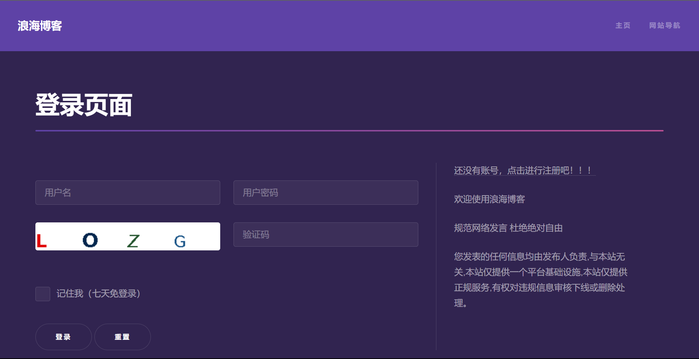

Langhai Blog  
[中文](./README.md)  

Introduction:  
Langhai Blog is a single architecture project built quickly based on SpirngBoot, 
which is simple and convenient to deploy and suitable for personal blog system construction.

Online presentation：http://www.langhai.cc  
The actual effect is subject to the code (the demo site is the previous version)   
contact information QQ：676558206 email 676558206@qq.com langhai666@gmail.com

Screenshot of some pages  


Deployment method:  [detailed description](https://langhai.cc/article/articleShow?id=38)  
linux ==>> nohup java -jar langhai-blogs.jar > langhai.log &  
windows ==>> java -jar langhai-blogs.jar

Technical selection:  
springboot Back-end rapid building framework   
thymeleaf Data template engine  
hutool Java toolset

Copyright/citation statement  
The main front-end template of Langhai blog system comes from the html5up.net website.  
The navigation module is from an open source project [geekape](https://github.com/geekape/geek-navigation)  

Basic components:  
Relational database MySQL  [MySQL All instructions](http://www.langhai.cc/article/articleShow?id=53)

```sql
/* 
	After importing langhaibologs/sql/langhaibologs.sql, you need to fill in the default data.
	The new role should be consistent with the code cc.langhai.config.constant.RoleConstant
*/
INSERT INTO role VALUES(1, 'admin', NOW(), NULL);
INSERT INTO role VALUES(2, 'user', NOW(), NULL);
INSERT INTO role VALUES(3, 'vip', NOW(), NULL);

```

Non-relational database Redis  
Picture storage server minio  [minio All instructions](http://www.langhai.cc/article/articleShow?id=54)  
Search engine (optional) elasticSearch  [elasticSearch All instructions](http://www.langhai.cc/article/articleShow?id=55)  
Message Queuing (optional) rabbitMQ   <a href="https://langhai.cc/article/articleShow?id=33">RabbitMQ All instructions</a>