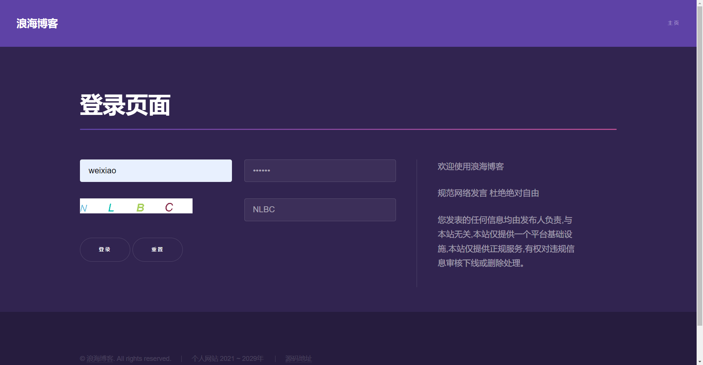

浪海博客   
[english](./README-EN.md)  

简介：
浪海博客，一个基于SpringBoot快速构建的单体架构项目，部署简单方便，适用于个人博客系统搭建。

在线演示：http://www.langhai.cc  
实际效果以代码为准（演示站点是以前的版本） 联系方式QQ：676558206 技术交流QQ群 585975304

部分页面截图  


部署方式：[详细说明](https://langhai.cc/article/articleShow?id=38)  
linux ==>> nohup java -jar langhai-blogs.jar > langhai.log &  
windows ==>> java -jar langhai-blogs.jar

技术选型：  
springboot 后端快速构建框架  
thymeleaf 数据模板引擎  
hutool java工具集

版权/引用声明  
浪海博客系统的主要前端模板来自html5up.net网站。  
博客前端模板 [燕十三博客模板](https://gitee.com/yssgit/yan_shisan_blog_template)  
导航模块来自开源项目 [geekape](https://github.com/geekape/geek-navigation)    
后台管理来自开源项目 [Pear Admin](https://gitee.com/pear-admin/Pear-Admin-Layui)

基本组件：  
关系型数据库 MySQL [MySQL 详细说明](http://www.langhai.cc/article/articleShow?id=53) 

```sql
/* 
	导入langhaiblogs/sql/langhaiblogs.sql之后需要填充默认数据。
	新增角色 注意和代码保持一致 cc.langhai.config.constant.RoleConstant
*/
INSERT INTO role VALUES(1, 'admin', NOW(), NULL);
INSERT INTO role VALUES(2, 'user', NOW(), NULL);
INSERT INTO role VALUES(3, 'vip', NOW(), NULL);

```

非关系型数据库 Redis  
图片存储服务器 minio [minio 详细说明](http://www.langhai.cc/article/articleShow?id=54)   
搜索引擎(可选) elasticSearch [elasticSearch 相关说明](http://www.langhai.cc/article/articleShow?id=55)   
消息队列（可选）rabbitMQ   <a href="https://langhai.cc/article/articleShow?id=33">rabbitMQ所有说明</a>