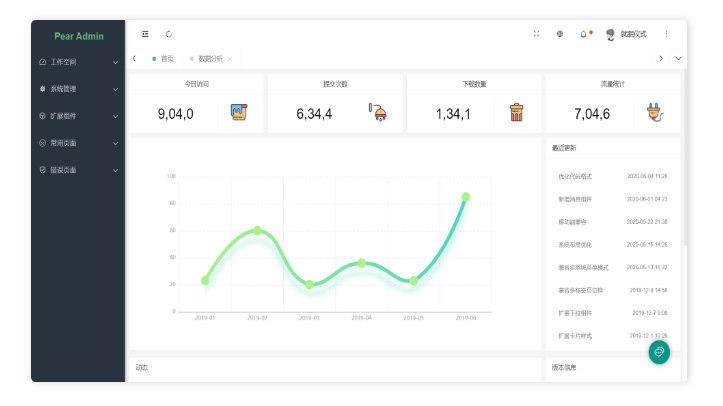

<div align="center">

<br/>
<br/>

  <h1 align="center">
    Pear Admin Layui
  </h1>
  <h4 align="center">
    开 箱 即 用 的 前 后 端 解 决 方 案
  </h4> 

  [预 览](http://layui.pearadmin.com)   |   [官 网](http://www.pearadmin.com/)  |   [文档](http://www.pearadmin.com/doc)

</div>

<p align="center">
    <a href="#">
        
    </a>
    <a href="#">
        
    </a>
      <a href="#">
        
    </a>
</p>

<br>

<div align="center">
  
</div>
<br>

### 项目介绍

<p style="padding:10px;"  width="90%">

Pear Admin 是一款开箱即用的前端开发模板，扩展Layui原生UI样式，集成第三方开源组件，提供便捷快速的开发方式，延续 Admin 的设计规范。

异步 Ajax 的菜单构建，完善的多标签页，单标签页的共存，丰富自由的布局方式，为研发者提供相对完善的前端解决方案。

若你需要更多版本 (Java Go Think 等)，请前往 [Pear Admin 社区](https://gitee.com/pear-admin)

项目不定时更新，建议 Star watch 一份

</p>

### Branch 说明

<p style="padding:10px;"  width="90%">

main: 最新的功能，主要维护的版本。

package: 通过 gulp.js 提供打包构建，适合对资源加载和编译速度有要求的项目。

i18n: 集成 translate.js 提供 i18n 国际化功能的版本。

</p>

### 项目结构

```
Pear Admin Layui
│
├─admin 资源
│    │
│    ├─css 样式
│    │
│    ├─data 数据
│    │
│    └─images 图片
│
├─component 组件
│    │
│    ├─code 设计器
│    │
│    ├─layui 核心框架
│    │
│    └─pear 扩展组件
│
├─config 配置
│    │
│    ├─pear.config.yml 配置文件
│    │
│    └─pear.config.json 配置文件
│
├─view 视图
│    │
│    ├─console 首页
│    │
│    ├─document 文档
│    │
│    ├─echarts 图表
│    │
│    ├─error 错误页
│    │
│    ├─result 结果页
│    │
│    └─system 系统管理
│
├─index.html 入口
│
└─login.html 登录

```

### 项目截图

|  |  |
|---------------------|---------------------|
|  |   |
||    |
||   |
||     |
||    |
||   |
||    |
||    |
||   |
||   |

### 开源共建

<p style="padding:10px;"  width="90%">

1. 欢迎提交 [pull request](https://gitee.com/pear-admin/Pear-Admin-Layui/pulls)，注意对应提交对应 `master` 分支

2. 欢迎提交 [issue](https://gitee.com/pear-admin/Pear-Admin-Layui/issues)，请写清楚遇到问题的原因、开发环境、复显步骤。

</p>

感谢每一位贡献代码的朋友。

如果对您有帮助，您可以点右上角 💘Star💘 支持